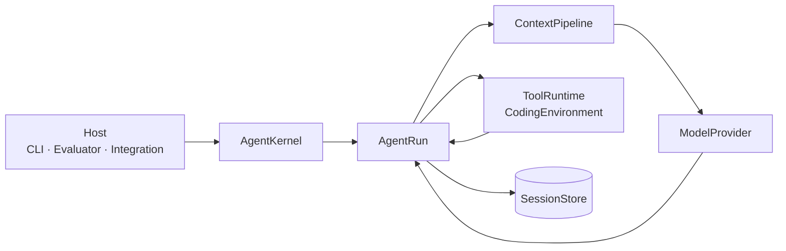

<h1 align="center">Coding Agent Kernel</h1>

<p align="center"><strong>An observable, recoverable, and permission-controlled headless Python Coding Agent Kernel.</strong></p>

<p align="center">
  <a href="README.md">简体中文</a> · <strong>English</strong>
</p>

<p align="center">
  <a href="https://github.com/Ev3rGan/coding-agent-kernel/actions/workflows/ci.yml"></a>
  
  <a href="LICENSE"></a>
</p>

Coding Agent Kernel is an independently implemented Python runtime that brings model streaming,
Tool Execution, durable Sessions, Model Context, run control, and Host permission decisions behind
one public interface. The Terminal CLI, SWE-bench evaluator, and future Hosts all drive the Kernel
through the same `AgentKernel` / `AgentRun` boundary.

> [!IMPORTANT]
> This is experimental `0.x` software. Public interfaces and persisted formats may change before
> `1.0`; the project does not claim production sandboxing or guaranteed outcomes for arbitrary
> SWE-bench tasks or model calls.

## ✨ Why this Kernel exists

Many coding-agent examples stop after calling a model API and executing one command. This project
implements and validates the full runtime path:

- **Headless by design**: the Kernel is not coupled to an IDE, TUI, or product shell.
- **Observable by default**: model increments, ToolCalls, ToolResults, permission requests, Sessions,
  and the single terminal result are all inspectable.
- **Recoverable state**: a Session is a durable, branching append-only tree rather than a transient
  chat transcript.
- **Controlled authority**: neither models nor Extensions can grant themselves more authority;
  the Host owns the final decision.
- **Evidence over claims**: deterministic failure cases, quality gates, and real SWE-bench Harness
  results remain available for inspection.

The project uses Pi as the behavioral baseline for the selected Kernel scope, while the code,
Python expression, public interface, persistence format, and Permission Policy are independently
implemented. See [ADR 0001](docs/adr/0001-pi-baseline-independent-python-kernel.md) and the
[Canonical Spec](docs/specs/coding-agent-kernel.md).

## 🧭 Core capabilities

| Capability | Public guarantee |
| --- | --- |
| Observable Agent Run | `AgentRun` is the single interface for event iteration, steering, follow-up, cancellation, permission responses, and the final result |
| Model–tool–model loop | Provider events are normalized; Tools follow explicit scheduling rules and results return in original ToolCall order |
| Durable Session | Authoritative messages form a resumable, branching Session tree backed by matching in-memory and JSONL Stores |
| Deterministic Context | Each Provider request projects only the Active Branch, current authoritative resources, and already injected messages |
| Semantic Compaction | Older history becomes a traceable checkpoint while recent complete turns and raw Session records remain available |
| Host permissions | Run-scoped `plan`, `ask`, `auto`, and `full` modes govern Tool Execution |
| Fixed Extensions | Tools, Providers, SessionEntry types, and Hooks are explicitly registered and revalidated after every change |

## 🚀 60-second quickstart

Python 3.11 or newer is required. Install from a source checkout:

```console
python -m pip install .
```

Start with deterministic demos that need no API key and make no network requests:

```console
python -m coding_agent demo streamed-run
python -m coding_agent demo tool-loop
```

The first command prints a complete JSON Lines lifecycle. The second runs `read`, `edit`, and
`bash` in a temporary workspace and sends ordered ToolResults back to the Fake Provider. See the
[deterministic demo guide](docs/guides/demos.md) for additional success and failure cases.

## 🤖 Run a real coding task

Inject the DeepSeek API key into the current Host process environment only:

```powershell
$env:DEEPSEEK_API_KEY = "<YOUR_API_KEY>"
```

```bash
export DEEPSEEK_API_KEY="<YOUR_API_KEY>"
```

Then run against a disposable or explicitly authorized workspace:

```console
python -m coding_agent run --provider deepseek --workspace <workspace> --mode ask "<coding-task>"
```

The CLI streams `AgentSessionEvent` values as JSON Lines and finishes with the authoritative
result, Session information, changed paths, and a patch. In `ask` mode, controlled operations wait
for a one-time Host decision.

> [!WARNING]
> Never put an API key in the task, workspace, Session, configuration file, or shell history.
> `full` skips Kernel approval and workspace containment and is only appropriate for an explicitly
> trusted, disposable environment.

See the [DeepSeek guide](docs/guides/deepseek.md) for credential handling, Session resume,
Provider behavior, and failure semantics.

## 🧩 Python API

The CLI and evaluator use the same public seam:

```python
from coding_agent import AgentKernel, FakeProvider


async def observe_run() -> None:
    kernel = AgentKernel(FakeProvider.streamed_run())
    run = kernel.create_run("Demonstrate an observable run.")

    async for event in run:
        ...  # consume AgentSessionEvent values

    result = await run.result()
```

An `AgentRun` terminates exactly once as `settled`, `cancelled`, or `failed`; its authoritative
result comes from `await run.result()`. See the [architecture guide](docs/architecture.md) for
responsibility boundaries.

## 🏗️ Architecture



- `AgentKernel` assembles Provider, ToolRuntime, Session, Context, Permission, and Extension capabilities.
- `AgentRun` owns one run's controls, Event Stream, and single final result.
- `ContextPipeline` builds one Provider request from the Active Branch and current authority.
- `ToolRuntime` executes a ToolCall only after final argument validation and Permission Policy evaluation.
- `SessionStore` retains authoritative records; deltas, progress events, and pending messages are not history.

See [CONTEXT.md](CONTEXT.md) for canonical terminology and [docs/adr/](docs/adr/) for durable
design decisions.

## ✅ Real-world validation

The repository preserves auditable evidence produced by the real DeepSeek Adapter, the official
SWE-bench Verified dataset, and the official Harness rather than treating unit tests as external
acceptance:

| Instance | Context window | v2 checkpoints | Official Harness |
| --- | ---: | ---: | --- |
| `pallets__flask-5014` | 20,000 characters | 3 | resolved |
| `scikit-learn__scikit-learn-14141` | 20,000 characters | 1 | resolved |

These results apply to the recorded candidate versions and instances; they are not leaderboard
claims or guarantees for future tasks. Inspect the configurations, failed sample, Sessions,
patches, and Harness reports in the [Issue #33 validation archive](docs/validation/issue-33-context-compaction/README.md).
See the [SWE-bench guide](docs/guides/swebench.md) to run another instance.

CI runs Ruff lint and formatting, strict mypy, pytest, and a wheel build for pull requests and
pushes to `main`. The workflow is defined in [`.github/workflows/ci.yml`](.github/workflows/ci.yml).

## 🛡️ Scope and maturity

| Included today | Not claimed today |
| --- | --- |
| DeepSeek and deterministic Fake Provider Adapters | A complete Provider ecosystem or model-comparison platform |
| A headless Kernel, thin CLI, and SWE-bench evaluator | An IDE, TUI, or complete coding-agent product |
| Host-controlled Permission Policy | A production OS Sandbox or operating-system elevation |
| Recoverable Sessions, Context, and semantic Compaction | Long-term memory, vector retrieval, or unlimited context |
| Explicit Extension registry and fixed Hooks | Discovery, hot reload, or arbitrary plugin lifecycles |
| Auditable single-instance SWE-bench execution | A leaderboard, batch scheduler, or promised pass rate |

## 📚 Documentation

- [Documentation index](docs/README.md): entry points organized by use, architecture, validation, and contribution.
- [Architecture guide](docs/architecture.md): component responsibilities, run timeline, and authority boundaries.
- [DeepSeek guide](docs/guides/deepseek.md): real runs, resume, credentials, and Provider behavior.
- [Deterministic demos](docs/guides/demos.md): success, failure, cancellation, permissions, and Extensions.
- [SWE-bench guide](docs/guides/swebench.md): preparation, execution boundaries, artifacts, and result interpretation.
- [Canonical Spec](docs/specs/coding-agent-kernel.md): complete scope, decisions, and acceptance definition.
- [ADRs](docs/adr/): the behavioral baseline, headless seam, Extensions, and permissions.

## 🛠️ Development and contribution

Install development dependencies and run the same quality gates as CI:

```console
python -m pip install -e ".[dev]"
python -m ruff check .
python -m ruff format --check .
python -m mypy
python -m pytest
python -m build
```

Read [CONTRIBUTING.md](CONTRIBUTING.md) before contributing and follow the
[Code of Conduct](CODE_OF_CONDUCT.md). Report security concerns privately through
[SECURITY.md](SECURITY.md), not in a public issue.

## 📄 License

Licensed under the [Apache License 2.0](LICENSE).
