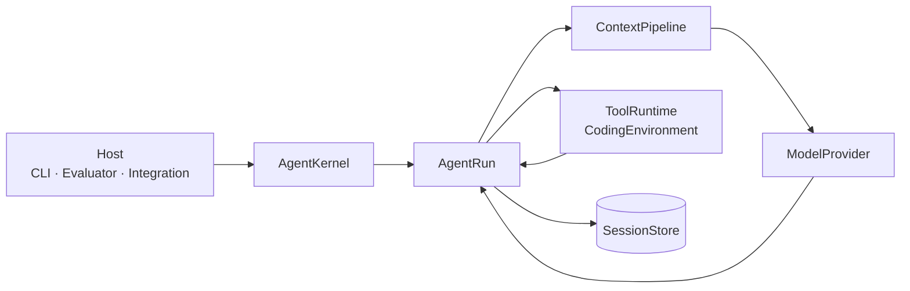

<h1 align="center">Coding Agent Kernel</h1>

<p align="center"><strong>一个可观察、可恢复、权限受控的 Headless Python Coding Agent Kernel。</strong></p>

<p align="center">
  <strong>简体中文</strong> · <a href="README.en.md">English</a>
</p>

<p align="center">
  <a href="https://github.com/Ev3rGan/coding-agent-kernel/actions/workflows/ci.yml"></a>
  
  <a href="LICENSE"></a>
</p>

Coding Agent Kernel 是一个独立实现的 Python 运行时：它把模型流式调用、Tool Execution、
持久化 Session、Model Context、运行时控制与 Host 权限决策收敛到同一套公开接口中。
Terminal CLI、SWE-bench evaluator 和未来的 Host 集成都通过同一个 `AgentKernel` / `AgentRun`
边界驱动内核。

> [!IMPORTANT]
> 当前版本是实验性 `0.x` 软件。公开接口和持久化格式在 `1.0` 前仍可能变化；项目不宣称
> 提供生产级 Sandbox，也不保证任意 SWE-bench 任务或模型调用都能成功。

## ✨ 为什么做这个 Kernel

许多 Coding Agent 示例止步于“调用模型 API 并执行一个命令”。本项目进一步实现并验证了
一条完整、可解释的运行路径：

- **Headless by design**：Kernel 不绑定 IDE、TUI 或产品 Shell，Host 只依赖稳定运行接口。
- **Observable by default**：模型增量、ToolCall、ToolResult、权限请求、Session 和唯一终态均可观察。
- **Recoverable state**：Session 是持久化、可恢复、可分支的 append-only tree，而不是临时聊天记录。
- **Controlled authority**：模型与 Extension 都不能自行提升权限，最终决定由 Host 持有。
- **Evidence over claims**：确定性故障场景、质量门禁和真实 SWE-bench Harness 结果均可复查。

项目以 Pi 的 Kernel 行为作为选定范围内的技术基线，但代码、Python 表达、公开接口、
持久化格式和 Permission Policy 均为独立实现。设计边界记录在
[ADR 0001](docs/adr/0001-pi-baseline-independent-python-kernel.md) 和
[Canonical Spec](docs/specs/coding-agent-kernel.md) 中。

## 🧭 核心能力

| 能力 | 对外保证 |
| --- | --- |
| Observable Agent Run | `AgentRun` 是事件迭代、steering、follow-up、取消、权限响应和最终结果的统一入口 |
| Model–tool–model loop | Provider 流事件被规范化；Tool 按显式调度规则执行，结果按原始 ToolCall 顺序返回 |
| Durable Session | 权威消息持久化为可恢复、可分支的 Session tree，支持内存与 JSONL Store |
| Deterministic Context | 每次 Provider 请求只投影当前 Active Branch、当前权威资源和已经注入的消息 |
| Semantic Compaction | 旧历史以可追溯 checkpoint 表示，近期完整 turns 和原始 Session 记录继续保留 |
| Host permissions | `plan`、`ask`、`auto`、`full` 四种 run-scoped 模式约束 Tool Execution |
| Fixed Extensions | Tool、Provider、SessionEntry type 与 Hook 通过固定 registry 显式注册并逐次重验证 |

## 🚀 60 秒快速开始

需要 Python 3.11 或更高版本。从源码 checkout 安装：

```console
python -m pip install .
```

先运行不需要 API key、不会访问外网的确定性演示：

```console
python -m coding_agent demo streamed-run
python -m coding_agent demo tool-loop
```

第一条命令输出完整的 JSON Lines 运行生命周期；第二条命令在临时 workspace 中执行
`read`、`edit` 和 `bash`，再把有序 ToolResults 送回 Fake Provider。更多成功与失败场景见
[确定性演示指南](docs/guides/demos.md)。

## 🤖 运行真实编码任务

把 DeepSeek API key 只注入当前 Host 进程环境：

```powershell
$env:DEEPSEEK_API_KEY = "<YOUR_API_KEY>"
```

```bash
export DEEPSEEK_API_KEY="<YOUR_API_KEY>"
```

然后对 disposable 或明确授权的 workspace 运行：

```console
python -m coding_agent run --provider deepseek --workspace <workspace> --mode ask "<coding-task>"
```

CLI 持续输出 `AgentSessionEvent` JSON Lines，并在结束时给出权威结果、Session 信息、
changed paths 和 patch。`ask` 模式会在写入或其他受控操作前等待 Host 的一次性决定。

> [!WARNING]
> 不要把 API key 写入 task、workspace、Session、配置文件或 shell history。`full` 会跳过
> Kernel approval 与 workspace containment，只应用于明确可信且可丢弃的运行环境。

凭据生命周期、Session resume、Provider 协议和失败语义见
[DeepSeek 运行指南](docs/guides/deepseek.md)。

## 🧩 Python API

CLI 和 evaluator 使用的也是下面这条公开 seam：

```python
from coding_agent import AgentKernel, FakeProvider


async def observe_run() -> None:
    kernel = AgentKernel(FakeProvider.streamed_run())
    run = kernel.create_run("Demonstrate an observable run.")

    async for event in run:
        ...  # consume AgentSessionEvent values

    result = await run.result()
```

`AgentRun` 的终态只能是 `settled`、`cancelled` 或 `failed`；最终结果由
`await run.result()` 返回。完整责任边界见[架构说明](docs/architecture.md)。

## 🏗️ 架构



- `AgentKernel` 组装 Provider、ToolRuntime、Session、Context、Permission 与 Extension 能力。
- `AgentRun` 拥有单次运行的控制面、Event Stream 和唯一最终结果。
- `ContextPipeline` 从 Active Branch 和当前权威资源构造一次 Provider 请求。
- `ToolRuntime` 在最终参数验证和 Permission Policy 决策之后执行 ToolCall。
- `SessionStore` 保存权威记录；流式 delta、进度事件和 pending message 不冒充历史事实。

规范术语见 [CONTEXT.md](CONTEXT.md)，不可逆设计选择见 [docs/adr/](docs/adr/)。

## ✅ 真实验证

仓库保存了真实 DeepSeek Adapter、官方 SWE-bench Verified 数据和官方 Harness 产生的
可审计证据，而不是用仓库内单元测试替代外部验收：

| Instance | Context window | v2 checkpoints | Official Harness |
| --- | ---: | ---: | --- |
| `pallets__flask-5014` | 20,000 characters | 3 | resolved |
| `scikit-learn__scikit-learn-14141` | 20,000 characters | 1 | resolved |

这些结果证明对应固定候选版本和实例的完整运行结果，不代表排行榜成绩或未来任务保证。
运行配置、失败样本、Session、patch 和 Harness 报告见
[Issue #33 验收档案](docs/validation/issue-33-context-compaction/README.md)。运行自己的实例见
[SWE-bench 指南](docs/guides/swebench.md)。

## 🛡️ 范围与成熟度

| 当前包含 | 当前不宣称 |
| --- | --- |
| DeepSeek 与确定性 Fake Provider Adapter | 完整 Provider 生态或模型比较平台 |
| Headless Kernel、薄 CLI 与 SWE-bench evaluator | IDE、TUI 或完整 Coding Agent 产品 |
| Host-controlled Permission Policy | 生产级 OS Sandbox 或操作系统提权 |
| 可恢复 Session、Context 与语义 Compaction | 长期记忆、向量检索或无限 Context |
| 显式 Extension registry 与固定 Hooks | 自动发现、热重载或任意插件生命周期 |
| 可审计的单实例 SWE-bench 执行 | 排行榜、批量调度或承诺通过率 |

## 📚 文档导航

- [文档总览](docs/README.md)：按使用、架构、验证和贡献组织的入口。
- [架构说明](docs/architecture.md)：组件职责、运行时间线和权威边界。
- [DeepSeek 运行指南](docs/guides/deepseek.md)：真实运行、恢复、凭据与 Provider 行为。
- [确定性演示](docs/guides/demos.md)：成功、失败、取消、权限和 Extension 场景。
- [SWE-bench 指南](docs/guides/swebench.md)：环境准备、执行边界、artifact 与结果解释。
- [Canonical Spec](docs/specs/coding-agent-kernel.md)：完整范围、决策和验收定义。
- [ADRs](docs/adr/)：行为基线、Headless seam、Extension 与权限决策。

## 🛠️ 开发与贡献

安装开发依赖并运行与 CI 相同的质量门禁：

```console
python -m pip install -e ".[dev]"
python -m ruff check .
python -m ruff format --check .
python -m mypy
python -m pytest
python -m build
```

贡献流程见 [CONTRIBUTING.md](CONTRIBUTING.md)，社区行为准则见
[CODE_OF_CONDUCT.md](CODE_OF_CONDUCT.md)。安全问题请按照 [SECURITY.md](SECURITY.md)
私下报告，不要创建公开 Issue。

## 📄 License

本项目采用 [Apache License 2.0](LICENSE)。
